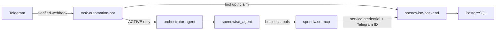

# Telegram enrollment implementation summary

## Architecture

Telegram authorization and enrollment run directly between `task-automation-bot` and `spendwise-backend`. They are not MCP tools. The backend owns the Telegram-to-SpendWise account mapping and invite lifecycle. The bot verifies the Telegram webhook, checks authorization before invoking an agent, and handles `/start <invite-token>` without invoking the LLM or MCP.

## Changes by service

### `task-automation-bot`

- Added Telegram webhook secret validation using `X-Telegram-Bot-Api-Secret-Token`.
- `/start <token>` submits a pending claim to the backend and tells the user admin approval is required; `/start` without a token does not enter the agent flow.
- Normal messages call the backend authorization lookup first. Unknown and blocked accounts do not reach the orchestrator, SpendWise agent, MCP, or business APIs.
- Added an MCP tool interceptor that replaces any model-supplied `telegram_user_id` with the ID from the verified Telegram update.
- Removed the old bootstrap and automation access-token exchange behavior. Conversation memory now uses protected internal backend endpoints.
- Added `requirements-dev.txt` and Telegram enrollment tests.

### `spendwise-mcp`

- Removed Telegram authorization and invitation MCP tools.
- Business API calls use a service credential plus the trusted Telegram ID. The backend resolves that ID to the canonical SpendWise user.
- `MCP_AUTH_TOKEN` protects bot-to-MCP access and must be different from the MCP-to-backend credential.
- Empty optional configuration values now fall back to defaults rather than causing integer or float parsing errors.

### `spendwise-backend`

- Added `telegram_accounts` and `telegram_invites` JPA entities. Telegram IDs and invite hashes are unique; invite status tracks active, claimed, used, revoked, and expired states.
- Invite tokens are cryptographically random, URL-safe, and stored only as SHA-256 hashes. Claiming locks the invite row and binds it to the first Telegram ID. Admin approval locks the claim, creates a SpendWise profile and active Telegram mapping transactionally, and seeds default categories.
- Added authenticated endpoints:
  - `POST /api/v1/admin/telegram/invites` to create a generic invite.
  - `GET /api/v1/admin/telegram/claims` to list pending claims.
  - `POST /api/v1/admin/telegram/claims/{inviteId}/approve` or `/reject` to review a claim.
  - `POST /api/v1/admin/telegram/invites/{inviteId}/revoke` to revoke an active or claimed invite.
  - `PATCH /api/v1/admin/telegram/users/{telegramUserId}/status` to block or reactivate an account.
  - `GET /api/v1/internal/telegram/users/{telegramUserId}` for bot authorization lookup.
  - `POST /api/v1/internal/telegram/claim` to submit a claim.
- Added protected internal conversation-memory endpoints and a backend authentication filter that maps an active Telegram ID to the existing SpendWise user for business API calls.
- Added configurable bot username and invite expiry. Compose now reads OAuth credentials and service tokens from environment variables.
- The repository has no Flyway/Liquibase setup; new tables follow its existing `spring.jpa.hibernate.ddl-auto=update` convention.

## Credentials and setup

Configure these as independent secrets:

| Variable | Used by | Purpose |
| --- | --- | --- |
| `TELEGRAM_BOT_TOKEN` | Bot | Bot-to-Telegram API calls |
| `TELEGRAM_WEBHOOK_SECRET` | Bot and Telegram webhook configuration | Verifies incoming webhook requests |
| `SPENDWISE_TELEGRAM_SERVICE_TOKEN` | Bot and backend | Authorization, invite claims, and memory endpoints |
| `SPENDWISE_AUTOMATION_SERVICE_TOKEN` | MCP and backend | MCP business API calls |
| `SPENDWISE_TELEGRAM_ADMIN_TOKEN` | Administrator and backend | Invite management and Telegram account status |
| `SPENDWISE_MCP_AUTH_TOKEN` / `MCP_AUTH_TOKEN` | Bot / MCP | The same secret for bot-to-MCP authentication |

Also configure `TELEGRAM_BOT_USERNAME` and optionally `TELEGRAM_INVITE_EXPIRATION_MINUTES` (default: 30). The bot and MCP environment templates are in their respective repositories; backend Compose values are documented in `docker-compose.env.example`.

To create an invite, call `POST /api/v1/admin/telegram/invites` with an admin bearer token and no request body. Send the returned `inviteUrl` to the user. Telegram delivers it to the bot as `/start <token>`. Review claims with `GET /api/v1/admin/telegram/claims` and approve or reject them by `inviteId`. Verify the claimed Telegram identity out of band before approving. Approval creates a new SpendWise account for a first-time user. Revoke an unclaimed invitation using its returned `inviteId`.

## Verification

- `task-automation-bot`: 19 tests passed.
- `spendwise-mcp`: 15 tests passed.
- `spendwise-backend`: `mvn test` passed.

Changes remain uncommitted.
