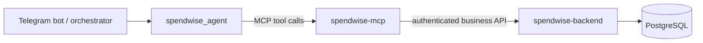

# SpendWise MCP

`spendwise-mcp` is the Model Context Protocol server that exposes SpendWise business capabilities to `spendwise_agent`. It translates agent tool calls into backend REST operations.

## Role in the system

The MCP server sits between the agent and `spendwise-backend`. It exposes business operations such as working with expenses, categories, budgets, and analytics. The backend remains responsible for business rules, authorization, user ownership, and persistence.

## Responsibilities

- Register and serve agent-facing SpendWise business tools.
- Validate and translate tool inputs into backend API requests.
- Authenticate to the backend as a service and pass trusted Telegram context where applicable.
- Centralize backend HTTP behavior, timeout, retry, and error translation.
- Log tool and backend request lifecycle details without logging secrets or sensitive payloads.

## Boundaries

MCP is not the Telegram webhook handler and does not parse Telegram updates. It must not implement invite generation, claim approval, Telegram activation, or Telegram authorization lookup. Those are application security workflows owned by the bot and backend. The LLM must not choose the authenticated user; backend derives the SpendWise user from trusted service identity context.

